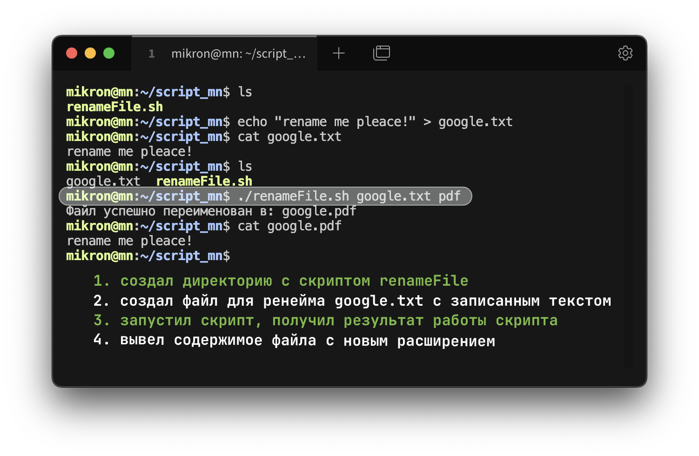
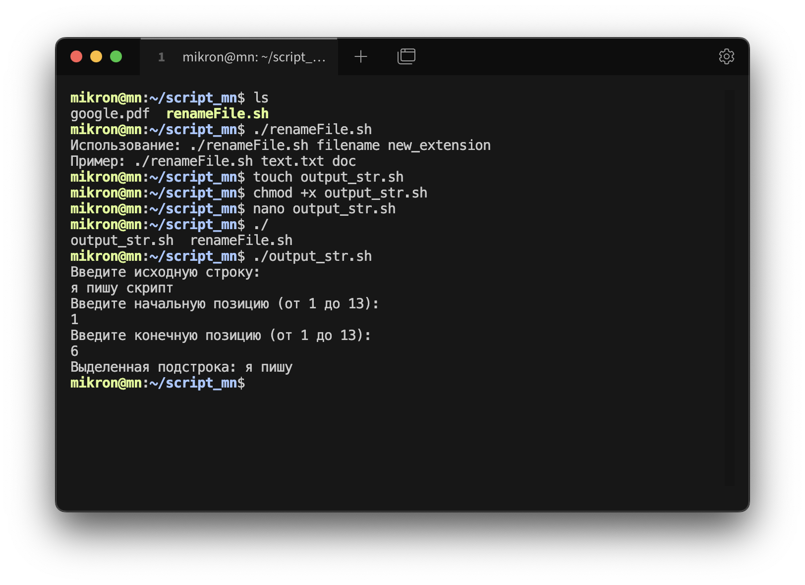

# Домашнее задание из личного кабинета.

**Цель**: получить практический опыт установки пакетов с помощью
сторонних репозиториев и пакетного менеджера. Научиться
выполнять задачи автоматизации с помощью Bash.
### Задание 1 – установить MongoDB.
*создать таблицу data; создать пользователя manager, у которого будет доступ
только на чтение этой таблицы.
### Задание 2 – ознакомиться с нижеуказанной статьей по теме «Bash»
https://habr.com/ru/post/52871/
### Задание 3 – написать Bash-скрипт в соответствии с требованиями:
Содержание скрипта: замена существующего расширения в имени файла на
заданное. Исходное имя файла и новое расширение передаются скрипту в
качестве параметров. Основное средство: нестандартное раскрытие
переменных. Усложнение: предусмотреть штатную реакцию на отсутствие
расширения в исходном имени файла.
### Задание 4 – написать Bash-скрипт в соответствии с требованиями:
Содержание скрипта: выделение из исходной строки подстроки с границами,
заданными порядковыми номерами символов в исходной строке. Усложнение:
предусмотреть возможность не выделения, а удаления подстроки.Основные
средства: команда cut, переменные оболочки

# Выполнение 

1. Установка MongoDB (для Ubuntu):

### Согласно документации MongoDB проходимся по этапам: 


# Выполняем


```bash
# Импорт публичного ключа MongoDB
wget -qO - https://www.mongodb.org/static/pgp/server-6.0.asc | sudo apt-key add -

# Создание файла источника для MongoDB
echo "deb [ arch=amd64,arm64 ] https://repo.mongodb.org/apt/ubuntu $(lsb_release -cs)/mongodb-org/6.0 multiverse" | sudo tee /etc/apt/sources.list.d/mongodb-org-6.0.list

# Обновление пакетов
sudo apt-get update

# Установка MongoDB
sudo apt-get install -y mongodb-org

# Запуск MongoDB
sudo systemctl start mongod
sudo systemctl enable mongod
```
### Создание таблицы (коллекции) data и пользователя manager:

```bash
// Подключение к MongoDB
mongosh

// Создание базы данных и коллекции
use admin
db.createUser({
  user: "admin",
  pwd: "adminadmin",
  roles: [ { role: "userAdminAnyDatabase", db: "admin" } ]
})

// Создание базы данных и коллекции data
use mydb
db.createCollection("data")

// Создание пользователя manager с правами только на чтение
db.createUser({
  user: "manager",
  pwd: "managermanager",
  roles: [
    { role: "read", db: "mydb" }
  ]
})
```


### После создания пользователей нужно включить аутентификацию в MongoDB:

```bash
# Редактируем конфигурационный файл
sudo nano /etc/mongod.conf

# Добавляем/изменяем секцию security:
security:
  authorization: enabled

# Перезапускаем MongoDB
sudo systemctl restart mongod
```


### Теперь пользователь **manager** сможет только читать данные из коллекции data, но не сможет их изменять.


# Task 3
### Bash. Замена существующего расширения в имени файла на заданное

```bash
1. Создал директорию для скрипта, где будет также размещаться файл для переименования 
2. Создал командой touch файл (наш скрипт) с расширением sh
3. Командой chmod +x renameFile.sh дал разрешение на execute 
4. Открыл файл: nano renameFile.sh 
5. Первой строкой указал шебанг: #!/bin/bash
```




```bash
Если ввести имя файла, которого нет, скрипт выведит:
Ошибка: файл 'filename' не существует
```

# Task 4
### Bash. Выделение из исходной строки подстроки с границами,заданными порядковыми номерами символов в исходной строке.

#### Действия по созданию скрипта аналогичны  предыдущему заданию

