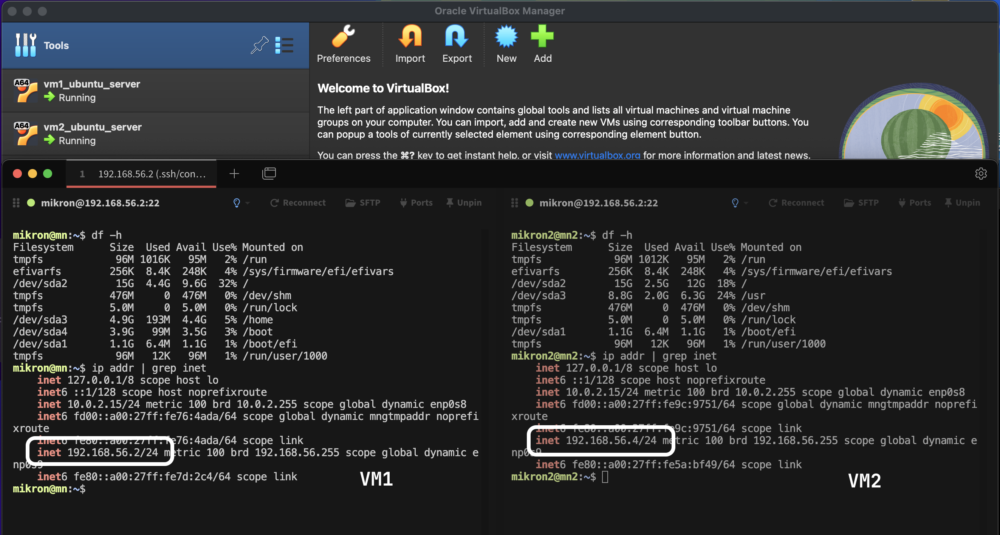
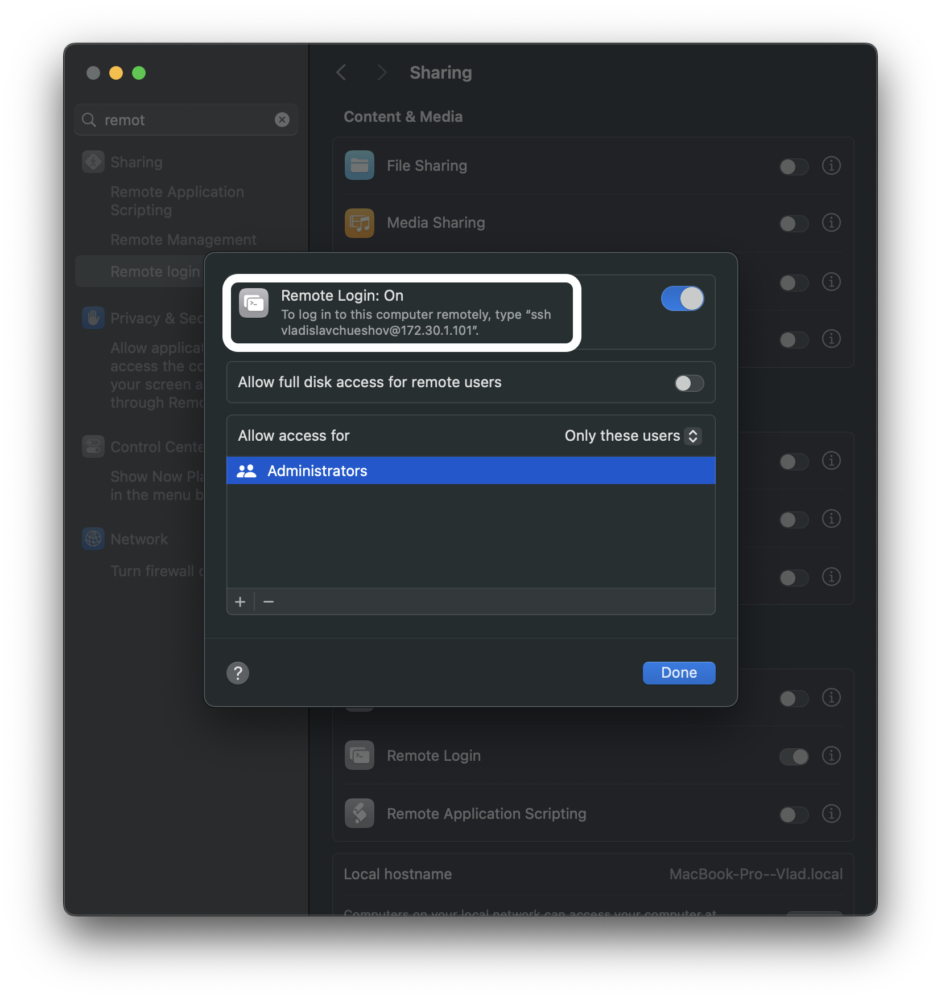
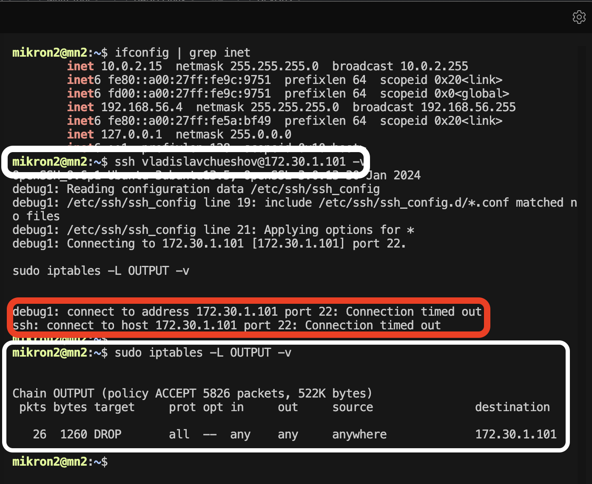
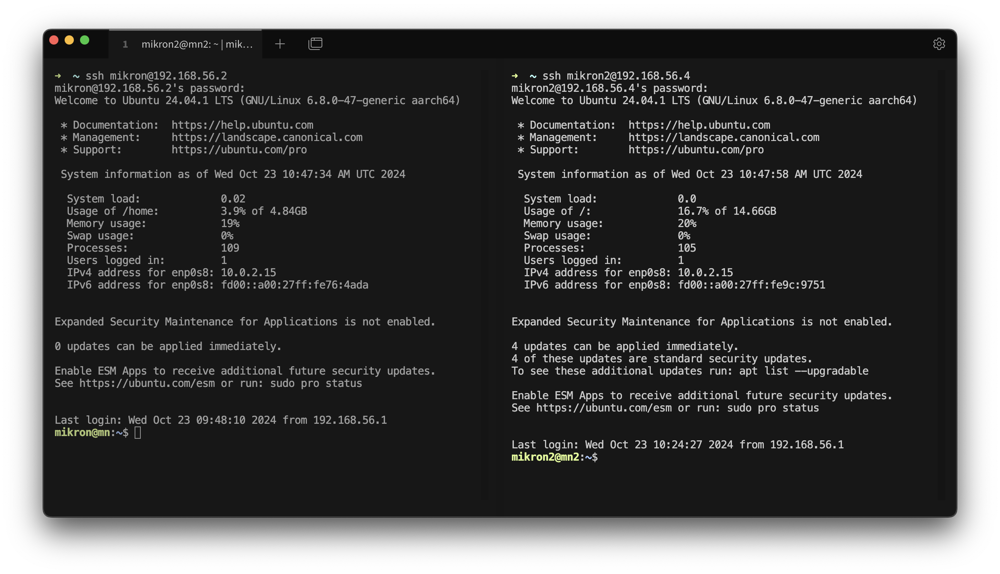
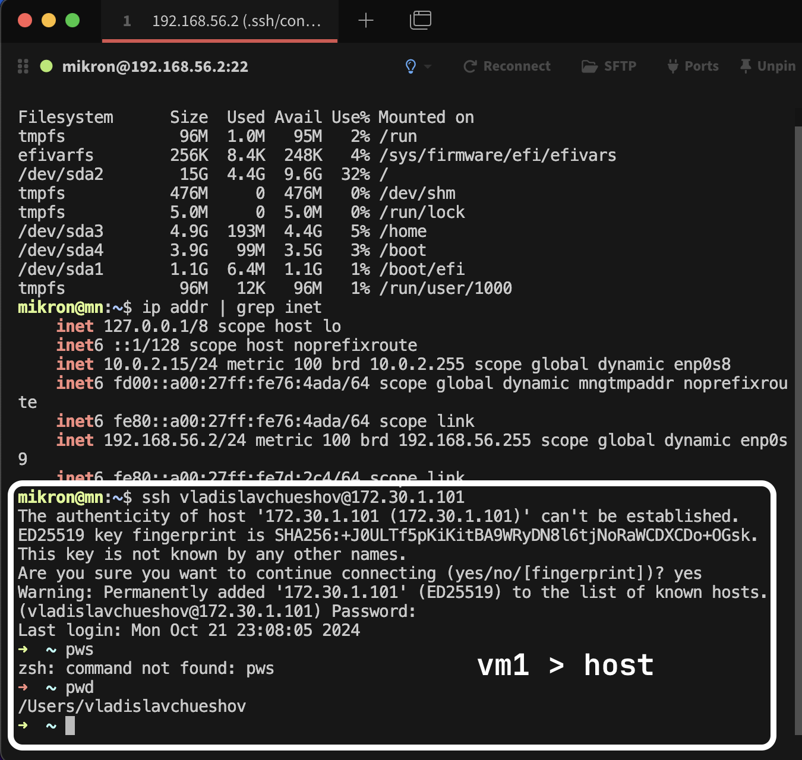

**Задачи**
1. Создайте 2 виртаульных машины (далее - VM1, VM2. Вы можете дать любое удобное вам название). Используйте образ ubuntu24.10
2. Пройдите польностью все этапы установки и вручную разбейте свободное пространство на диски.
3. Настройте SSH-соеденение следующим образом: хостовая ОС -> VM1, VM1 -> хостовая ос, VM2 -> VM1, VM2 -x> хостовая ОС. Запрет соеденения можно осуществить любым удобной полиси через iptables.

* с помощью инструмента Hashicorp Packer создайте образы двух виртуальных машин с заранее подготовленными предустановками, описанными выше. Должно быть 2 конфига." 
  
# Настройка виртуальных машин и SSH-соединений в VirtualBox

## 1. Создание виртуальных машин

Созданы две виртуальные машины с Ubuntu:


## 2. Настройка сети в VirtualBox

### VM1
- Адаптер 1: NAT
- Адаптер 2: внутренняя сеть (internal network)

### VM2
- Адаптер 1: NAT
- Адаптер 2: внутренняя сеть (internal network)


## 3. Настройка SSH

### VM1
Поскольку при инсталяцци было выбран чекбокс install ssh-server
Редактируем `/etc/ssh/sshd_config`:
```conf
PermitRootLogin no
PasswordAuthentication yes
```

Перезапускаем SSH:
```bash
sudo systemctl restart sshd
```

### VM2
Выполняем те же действия, что и для VM1.

## 4. Настройка iptables на VM2

Запрет доступа к хостовой ОС:
```bash
sudo iptables -A OUTPUT -d 172.30.1.65 -j DROP
```
Предаварительно открываем подключение к хосту:





Установка и сохранение правил:
```bash
sudo apt-get install iptables-persistent
sudo netfilter-persistent save
```

## 5. Проверка соединений

```bash
# С хостовой ОС к VM1
ssh mikron@92.168.56.2
# С хостовой ОС к VM2
ssh mikron2@92.168.56.4
```


# С VM1 к хостовой ОС
```bash
ssh username@h92.168.56.4
```


```bash
# С VM2 к VM1
ssh mikron2@192.168.56.2
```
Коннект коректен, проиллюстировать можно только gif


## Для удобства подключения к vm по SSH без ввода PW использовал селедующее:


## 1. Генерация ключевой пары на хосте:
```bash
ssh-keygen -t rsa -b 4096
```
### Параметры:
- `-t rsa`: тип ключа
- `-b 4096`: длина ключа

### Создаваемые файлы:
- `~/.ssh/id_rsa` (приватный ключ)
- `~/.ssh/id_rsa.pub` (публичный ключ)

## 2. Копирование публичного ключа на сервер:
```bash
ssh-copy-id user@server_ip
```
## 3. Подключение:
```bash
ssh user@server_ip
```